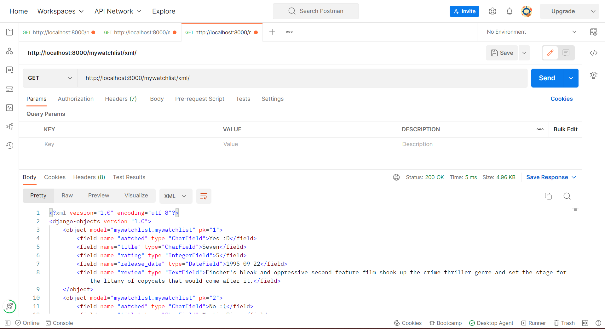

Nama    : Ahmad Hanif Adisetya 
NPM     : 2106750603 
Kelas   : PBP C 
Link    : https://katalog-hanif.herokuapp.com/mywatchlist/

### Jelaskan perbedaan antara JSON, XML, dan HTML!
- JSON atau JavaScript Object Notation merupakan  
- XML eXtensible Markup Language merupakan
- HTML atau HyperText Markup Language merupakan sebuah markup language standar yang digunakan untuk di-display pada browser. 

### Jelaskan mengapa kita memerlukan data delivery dalam pengimplementasian sebuah platform?

### Jelaskan bagaimana cara kamu mengimplementasikan checklist di atas.
1)  Membuat suatu aplikasi baru bernama mywatchlist di proyek Django Tugas 2 pekan lalu. 
Masuk terlebih dahulu ke folder tugas 2, lalu ke command prompt. Nyalakan virtual environment dengan command **python -m venv env** lalu dilanjutkan dengan **env\Scripts\activate.bat** (untuk Windows). Setelah itu, ketik command **python manage.py startapp mywishlist**.
2) Menambahkan path mywatchlist sehingga pengguna dapat mengakses http://localhost:8000/mywatchlist. 
Pergi ke folder project_django dan masuk ke urls.py. pada bagian urlpatterns, tambahkan **path("mywatchlist/", include("mywatchlist.urls"))** agar aplikasi mywatchlist dapat diakses. Tak lupa untuk menambahkan mywatchlist pada settings.py bagian INSTALLED_APPS.
3) Membuat sebuah model MyWatchList yang memiliki atribut. 
Pada folder mywatchlist, buka file models.py dan tambahkan class MyWatchList dengan argumen models.Model. MyWatchList akan menjadi model kita. Tambahkan atribut di dalam class MyWatchList. Sesuai petunjuk soal kita perlu menambahkan atribut watched dalam bentuk models.CharField() (Untuk menulis "Yes :D" atau "No :("), atribut title dalam bentuk models.CharField(), atribut rating dalam bentuk models.IntegerField(), atribut release date dalam bentuk models.DateField(), dan atribut review dalam bentuk model.TextField().
4) Menambahkan minimal 10 data untuk objek MyWatchList yang sudah dibuat di atas. 
Buat folder fixtures dalam folder mywatchlist. Tambahkan file initial_watchlist_data.json dalam folder tersebut dan tuliskan data sebanyak 10. Tiap data harus mengandung model, pk, serta fields yang berisi atribut models yang telah dibuat pada step sebelumnya. 
5) Mengimplementasikan sebuah fitur untuk menyajikan data yang telah dibuat sebelumnya dalam tiga format. 
Untuk ini buka views.py dan import model MyWatchList dari models.py, serta import HttpRespons & serializers. Buatlah 3 fungsi yakni show_watchlist, show_json, dan show_xml yang mengambil argumen request. Pada ketiga fungsi, set variable data = MyWatchList.objects.all(). Untuk show_watchlist set variable dictionary context dan masukkan pasangan key:value yakni "watchlist":  data, "nama": nama_anda, "npm": npm_anda. Lalu return dalam bentuk render(request, "mywatchlist.html", context). Sedangkan untuk show_json tidak perlu variable context, dapat langsung return HttpResponse(serializers.serialize("json", data), content_type="application/json"), content_type="application/xml"). show_xml mirip dengan show_json, hanya saja pada bagian return kita tulis return HttpResponse(serializers.serialize("xml", data), content_type="application/xml").
6)  Membuat routing sehingga data di atas dapat diakses melalui URL. 
Buatlah file path pada folder mywatchlist dan import urls serta fungsi yang telah dibuat pada step sebelumnya. Buat variable app_name dan tambahkan nama aplikasi mywatchlist. Buat suatu list bernama urlpatterns dan tambahkan path yang diinginkan. URL dan apa yang terdapat pada url patterns adalah sebagai berikut: 
http://localhost:8000/mywatchlist -> path("", show_watchlist, name="show_watchlist") 
http://localhost:8000/mywatchlist/html -> path("html/", show_watchlist, name="show_watchlist") 
http://localhost:8000/mywatchlist/xml -> path("xml/", show_xml, name="show_xml") 
http://localhost:8000/mywatchlist/json -> path("json/", show_json, name="show_json") 
7) Melakukan deployment ke Heroku terhadap aplikasi yang sudah kamu buat sehingga nantinya dapat diakses oleh teman-temanmu melalui Internet. 
Dikarenakan kita membuat aplikasi mywatchlist pada project yang sama dengan tugas 2, kita tidak perlu melakukan deploymen lagi (yeyy). Namun kita harus tetap melakukan makemigrations, migrate, dan loaddata. Lalu lakukan git add, commit, dan push pada repository. Setelah itu pergi ke heroku dan buka aplikasi untuk tugas 2. Pada bagian more, pilih run a console lalu ketik bash. Setelah itu akan muncul terminal, yang harus kita lakukan adalah ketik command **python manage.py loaddata initial_watchlist_data.json**. Setelah selesai, aplikasi dapat diakses melewati link yang ada! (pada awal README.md) 

### Postman
HTML

JSON

XML
